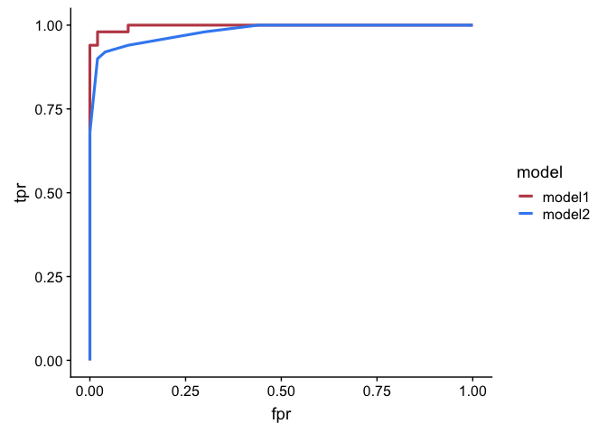
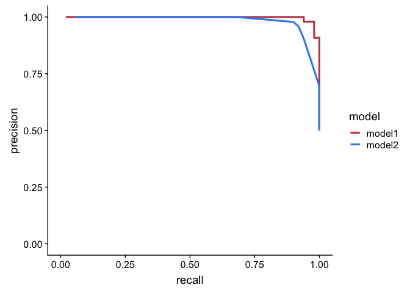

tidyroc
=======

This a repository for an R package `tidyroc`. `tidyroc` is currently
under development, and I plan to release it this summer (summer 2019).

Usage
-----

`tidyroc` has 3 primary functions:

-   to generate values to plot a receiver operating characteristic (ROC)
    curve  
-   to generate values to plot a precision-recall curve  
-   to calculate area under an ROC and precision-recall curves (AUC)

`tidyroc` is designed to be integrated with the Tidyverse. It is
intended to work with `broom`, `dplyr`, and `ggplot2`.

Examples
--------

#### Plot ROC curves for 2 different models

    # load packages required to run this code chunk
    library(ggplot2)
    library(dplyr)

    ## 
    ## Attaching package: 'dplyr'

    ## The following objects are masked from 'package:stats':
    ## 
    ##     filter, lag

    ## The following objects are masked from 'package:base':
    ## 
    ##     intersect, setdiff, setequal, union

    library(broom)
    library(cowplot)

    ## 
    ## Attaching package: 'cowplot'

    ## The following object is masked from 'package:ggplot2':
    ## 
    ##     ggsave

    # load tidyroc
    devtools::load_all(".")

    ## Loading tidyroc

    ## 
    ## Attaching package: 'testthat'

    ## The following object is masked from 'package:dplyr':
    ## 
    ##     matches

    # make a reduced iris data set that only contains virginica and versicolor species
    iris.small <- filter(iris, Species %in% c("virginica", "versicolor"))

    # fit a logistic regression model to the data to assess the model's performance
    d1 <- glm(Species ~ Petal.Width + Petal.Length + Sepal.Width,
      data = iris.small,
      family = binomial
    ) %>%
      augment() %>%
      mutate(model = "model1") # name the model

    ## Warning: glm.fit: fitted probabilities numerically 0 or 1 occurred

    # fit a different logistic regression model to the data to assess this model's performance
    d2 <- glm(Species ~ Petal.Width,
      data = iris.small,
      family = binomial
    ) %>%
      augment() %>%
      mutate(model = "model2") # name the model

    # combine the two datasets to make an ROC curve for each model
    d <- bind_rows(d1, d2)

    # plot ROC curves
    d %>%
      group_by(model) %>% # group to get individual ROC curve for each model
      make_roc(predictor = .fitted, known_class = Species) %>% # get values to plot an ROC curve
      ggplot(aes(x = fpr, y = tpr, color = model)) +
      geom_line(size = 1.1) +
      scale_color_manual(values = c("#C04A56", "#3D8CF1")) +
      theme_cowplot()

#### Plot precision-recall curves for 2 different models

    # load packages required to run this code chunk
    library(ggplot2)
    library(dplyr)
    library(broom)
    library(cowplot)

    # load tidyroc
    devtools::load_all(".")

    ## Loading tidyroc

    # make a reduced iris data set that only contains virginica and versicolor species
    iris.small <- filter(iris, Species %in% c("virginica", "versicolor"))

    # fit a logistic regression model to the data to assess the model's performance
    d1 <- glm(Species ~ Petal.Width + Petal.Length + Sepal.Width,
      data = iris.small,
      family = binomial
    ) %>%
      augment() %>%
      mutate(model = "model1") # name the model

    ## Warning: glm.fit: fitted probabilities numerically 0 or 1 occurred

    # fit a different logistic regression model to the data to assess this model's performance
    d2 <- glm(Species ~ Petal.Width,
      data = iris.small,
      family = binomial
    ) %>%
      augment() %>%
      mutate(model = "model2") # name the model

    # combine the two datasets to make an ROC curve for each model
    d <- bind_rows(d1, d2)

    # plot precision-recall curves
    d %>%
      group_by(model) %>% # group to get individual precision-recall curve for each model
      make_pr(predictor = .fitted, known_class = Species) %>% # get values to plot a precision-recall curve
      ggplot(aes(x = recall, y = precision, color = model)) +
      geom_line(size = 1.1) +
      coord_cartesian(ylim = c(0,1), xlim = c(0,1)) +
      scale_color_manual(values = c("#C04A56", "#3D8CF1")) +
      theme_cowplot()

